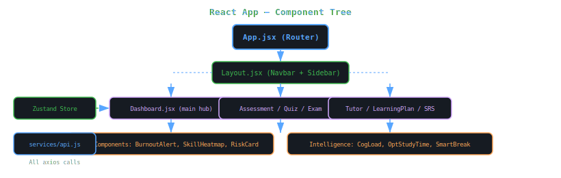

<body style="font-family:-apple-system,BlinkMacSystemFont,'Segoe UI',sans-serif;background:#0d1117;color:#c9d1d9;margin:0;padding:24px;line-height:1.7;max-width:1100px;margin:0 auto;">

  <h1 style="font-size:2.6em;color:#58a6ff;margin:0 0 8px;">⚛️ EduPath AI — Frontend</h1>
  
React 18 + Vite · Tailwind CSS · Framer Motion · Zustand · React Flow

  

    React 18
    Vite 5
    Tailwind CSS
    Framer Motion
    Port 5173
  

<!-- Component Architecture SVG -->
<h2 style="color:#79c0ff;font-size:1.5em;">🏗️ Component Architecture</h2>

<!-- Pages -->
<h2 style="color:#79c0ff;font-size:1.5em;">📄 Pages (18 files)</h2>

<table style="border-collapse:collapse;width:100%;margin:8px 0;">
<tr style="background:#161b22;"><th style="border:1px solid #30363d;padding:10px;color:#79c0ff;">Page</th><th style="border:1px solid #30363d;padding:10px;color:#79c0ff;">Route</th><th style="border:1px solid #30363d;padding:10px;color:#79c0ff;">Description</th></tr>
<tr><td style="border:1px solid #30363d;padding:10px;color:#58a6ff;">Dashboard.jsx</td><td style="border:1px solid #30363d;padding:10px;">/dashboard</td><td style="border:1px solid #30363d;padding:10px;">Main hub — 3D stat cards, AI recommendation, mastery grid, intelligence widgets</td></tr>
<tr><td style="border:1px solid #30363d;padding:10px;color:#58a6ff;">Assessment.jsx</td><td style="border:1px solid #30363d;padding:10px;">/assessment</td><td style="border:1px solid #30363d;padding:10px;">Skill selection for adaptive quiz</td></tr>
<tr><td style="border:1px solid #30363d;padding:10px;color:#58a6ff;">Quiz.jsx</td><td style="border:1px solid #30363d;padding:10px;">/quiz/:skillId</td><td style="border:1px solid #30363d;padding:10px;">Adaptive quiz with BKT-driven question selection</td></tr>
<tr><td style="border:1px solid #30363d;padding:10px;color:#d2a8ff;">Tutor.jsx</td><td style="border:1px solid #30363d;padding:10px;">/tutor</td><td style="border:1px solid #30363d;padding:10px;">Streaming AI chat interface with Gemini Pro</td></tr>
<tr><td style="border:1px solid #30363d;padding:10px;color:#d2a8ff;">LearningPlan.jsx</td><td style="border:1px solid #30363d;padding:10px;">/plan</td><td style="border:1px solid #30363d;padding:10px;">Weekly ML-generated learning plan with progress tracking</td></tr>
<tr><td style="border:1px solid #30363d;padding:10px;color:#d2a8ff;">SRSReview.jsx</td><td style="border:1px solid #30363d;padding:10px;">/srs</td><td style="border:1px solid #30363d;padding:10px;">Spaced repetition flashcard review session</td></tr>
<tr><td style="border:1px solid #30363d;padding:10px;color:#ffa657;">MistakeJournal.jsx</td><td style="border:1px solid #30363d;padding:10px;">/mistakes</td><td style="border:1px solid #30363d;padding:10px;">Review and resolve past wrong answers</td></tr>
<tr><td style="border:1px solid #30363d;padding:10px;color:#ffa657;">Exam.jsx</td><td style="border:1px solid #30363d;padding:10px;">/exam</td><td style="border:1px solid #30363d;padding:10px;">Timed exam with countdown and auto-submit</td></tr>
<tr><td style="border:1px solid #30363d;padding:10px;color:#ffa657;">Leaderboard.jsx</td><td style="border:1px solid #30363d;padding:10px;">/leaderboard</td><td style="border:1px solid #30363d;padding:10px;">Global XP ranking with animated podium</td></tr>
<tr><td style="border:1px solid #30363d;padding:10px;color:#3fb950;">Challenges.jsx</td><td style="border:1px solid #30363d;padding:10px;">/challenges</td><td style="border:1px solid #30363d;padding:10px;">Daily challenge tasks and todo list</td></tr>
<tr><td style="border:1px solid #30363d;padding:10px;color:#3fb950;">TeacherDashboard.jsx</td><td style="border:1px solid #30363d;padding:10px;">/teacher</td><td style="border:1px solid #30363d;padding:10px;">Class mastery overview and student management</td></tr>
<tr><td style="border:1px solid #30363d;padding:10px;color:#3fb950;">ClassInsightsDashboard.jsx</td><td style="border:1px solid #30363d;padding:10px;">/teacher/insights</td><td style="border:1px solid #30363d;padding:10px;">Performance trends, at-risk students, topic assignment</td></tr>
<tr><td style="border:1px solid #30363d;padding:10px;color:#8b949e;">Login.jsx / Register.jsx</td><td style="border:1px solid #30363d;padding:10px;">/login · /register</td><td style="border:1px solid #30363d;padding:10px;">Auth forms with role selection</td></tr>
<tr><td style="border:1px solid #30363d;padding:10px;color:#8b949e;">marketing/</td><td style="border:1px solid #30363d;padding:10px;">/ · /features · /about · /contact</td><td style="border:1px solid #30363d;padding:10px;">Public marketing pages</td></tr>
</table>

<!-- Key Components -->
<h2 style="color:#79c0ff;font-size:1.5em;">🧩 Key Components</h2>

<table style="border-collapse:collapse;width:100%;margin:8px 0;">
<tr style="background:#161b22;"><th style="border:1px solid #30363d;padding:10px;color:#79c0ff;">Component</th><th style="border:1px solid #30363d;padding:10px;color:#79c0ff;">Description</th></tr>
<tr><td style="border:1px solid #30363d;padding:10px;color:#ffa657;">StudyStreakCard.jsx</td><td style="border:1px solid #30363d;padding:10px;">7-day activity grid with animated streak counter and 3D tilt effect</td></tr>
<tr><td style="border:1px solid #30363d;padding:10px;color:#ffa657;">XPProgressBar.jsx</td><td style="border:1px solid #30363d;padding:10px;">Animated XP bar with level milestone markers and glow effect</td></tr>
<tr><td style="border:1px solid #30363d;padding:10px;color:#ffa657;">WeakSpotRadar.jsx</td><td style="border:1px solid #30363d;padding:10px;">Recharts radar chart built from mistake journal data</td></tr>
<tr><td style="border:1px solid #30363d;padding:10px;color:#d2a8ff;">GraphView.jsx</td><td style="border:1px solid #30363d;padding:10px;">React Flow canvas rendering the knowledge graph with animated edges</td></tr>
<tr><td style="border:1px solid #30363d;padding:10px;color:#d2a8ff;">AutoTutorPopup.jsx</td><td style="border:1px solid #30363d;padding:10px;">Floating AI tutor bubble that appears after wrong answers</td></tr>
<tr><td style="border:1px solid #30363d;padding:10px;color:#58a6ff;">BurnoutAlert.jsx</td><td style="border:1px solid #30363d;padding:10px;">Warning banner when burnout risk score exceeds threshold</td></tr>
<tr><td style="border:1px solid #30363d;padding:10px;color:#58a6ff;">SkillHeatmap.jsx</td><td style="border:1px solid #30363d;padding:10px;">Colour-coded grid showing mastery intensity per skill</td></tr>
<tr><td style="border:1px solid #30363d;padding:10px;color:#58a6ff;">StudentRiskCard.jsx</td><td style="border:1px solid #30363d;padding:10px;">Overall at-risk score combining all intelligence signals</td></tr>
<tr><td style="border:1px solid #30363d;padding:10px;color:#3fb950;">CognitiveLoadWidget.jsx</td><td style="border:1px solid #30363d;padding:10px;">Estimates mental load from session length and error rate</td></tr>
<tr><td style="border:1px solid #30363d;padding:10px;color:#3fb950;">OptimalStudyTimeWidget.jsx</td><td style="border:1px solid #30363d;padding:10px;">Recommends best study hours from historical accuracy patterns</td></tr>
</table>

<!-- Setup -->
<h2 style="color:#79c0ff;font-size:1.5em;">⚙️ Setup</h2>

<pre style="background:#161b22;border:1px solid #30363d;border-radius:8px;padding:16px;font-family:'Courier New',monospace;color:#e6edf3;">npm install
# configure .env (see below)
npm run dev          # Vite dev server on :5173
npm run build        # Production build → dist/
npm run preview      # Preview production build</pre>

<h3 style="color:#d2a8ff;">.env</h3>
<pre style="background:#161b22;border:1px solid #30363d;border-radius:8px;padding:16px;font-family:'Courier New',monospace;color:#e6edf3;">VITE_API_URL=http://localhost:5000/api
VITE_AI_URL=http://localhost:8000</pre>

<h3 style="color:#d2a8ff;">Key Dependencies</h3>
<table style="border-collapse:collapse;width:100%;margin:8px 0;">
<tr style="background:#161b22;"><th style="border:1px solid #30363d;padding:10px;color:#79c0ff;">Package</th><th style="border:1px solid #30363d;padding:10px;color:#79c0ff;">Version</th><th style="border:1px solid #30363d;padding:10px;color:#79c0ff;">Use</th></tr>
<tr><td style="border:1px solid #30363d;padding:10px;">react</td><td style="border:1px solid #30363d;padding:10px;">^18.2.0</td><td style="border:1px solid #30363d;padding:10px;">UI framework</td></tr>
<tr><td style="border:1px solid #30363d;padding:10px;">vite</td><td style="border:1px solid #30363d;padding:10px;">^5.1.0</td><td style="border:1px solid #30363d;padding:10px;">Build tool + HMR</td></tr>
<tr><td style="border:1px solid #30363d;padding:10px;">tailwindcss</td><td style="border:1px solid #30363d;padding:10px;">^3.4.1</td><td style="border:1px solid #30363d;padding:10px;">Utility CSS</td></tr>
<tr><td style="border:1px solid #30363d;padding:10px;">framer-motion</td><td style="border:1px solid #30363d;padding:10px;">^11.0.0</td><td style="border:1px solid #30363d;padding:10px;">Animations + 3D tilt</td></tr>
<tr><td style="border:1px solid #30363d;padding:10px;">reactflow</td><td style="border:1px solid #30363d;padding:10px;">^11.10.4</td><td style="border:1px solid #30363d;padding:10px;">Knowledge graph canvas</td></tr>
<tr><td style="border:1px solid #30363d;padding:10px;">recharts</td><td style="border:1px solid #30363d;padding:10px;">^2.10.4</td><td style="border:1px solid #30363d;padding:10px;">Radar + bar + line charts</td></tr>
<tr><td style="border:1px solid #30363d;padding:10px;">zustand</td><td style="border:1px solid #30363d;padding:10px;">^4.5.0</td><td style="border:1px solid #30363d;padding:10px;">Global state</td></tr>
<tr><td style="border:1px solid #30363d;padding:10px;">lucide-react</td><td style="border:1px solid #30363d;padding:10px;">^0.363.0</td><td style="border:1px solid #30363d;padding:10px;">Icon library</td></tr>
</table>

EduPath AI Frontend — React 18 + Vite + Tailwind + Framer Motion | Port 5173

</body>
