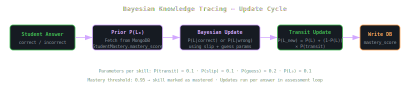
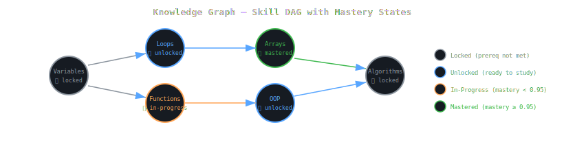

<body style="font-family:-apple-system,BlinkMacSystemFont,'Segoe UI',sans-serif;background:#0d1117;color:#c9d1d9;margin:0;padding:24px;line-height:1.7;max-width:1100px;margin:0 auto;">

  <h1 style="font-size:2.4em;color:#d2a8ff;margin:0 0 8px;">🧠 EduPath AI — Core Algorithms</h1>
  
Bayesian Knowledge Tracing · Knowledge Graph · Recommendation Engine · Plan Generator

  

    BKT
    NetworkX DAG
    Topological Sort
    Weighted Scoring
  

<!-- BKT Flow SVG -->
<h2 style="color:#79c0ff;font-size:1.5em;">📐 BKT Update Flow</h2>

<!-- Knowledge Graph SVG -->
<h2 style="color:#79c0ff;font-size:1.5em;">🕸️ Knowledge Graph Structure</h2>

<!-- Files -->
<h2 style="color:#79c0ff;font-size:1.5em;">📁 Files</h2>

<table style="border-collapse:collapse;width:100%;margin:8px 0;">
<tr style="background:#161b22;"><th style="border:1px solid #30363d;padding:10px;color:#79c0ff;">File</th><th style="border:1px solid #30363d;padding:10px;color:#79c0ff;">Algorithm</th><th style="border:1px solid #30363d;padding:10px;color:#79c0ff;">Key Functions</th></tr>
<tr>
  <td style="border:1px solid #30363d;padding:10px;color:#d2a8ff;">bkt_model.py</td>
  <td style="border:1px solid #30363d;padding:10px;">Bayesian Knowledge Tracing</td>
  <td style="border:1px solid #30363d;padding:10px;font-family:monospace;font-size:0.85em;">update_mastery(student_id, answers[]) → mastery_map</td>
</tr>
<tr>
  <td style="border:1px solid #30363d;padding:10px;color:#d2a8ff;">knowledge_graph.py</td>
  <td style="border:1px solid #30363d;padding:10px;">NetworkX DAG + React Flow conversion</td>
  <td style="border:1px solid #30363d;padding:10px;font-family:monospace;font-size:0.85em;">build_graph() → cache · get_graph(student_id) → {nodes, edges}</td>
</tr>
<tr>
  <td style="border:1px solid #30363d;padding:10px;color:#d2a8ff;">recommendation_engine.py</td>
  <td style="border:1px solid #30363d;padding:10px;">Weighted scoring + career alignment</td>
  <td style="border:1px solid #30363d;padding:10px;font-family:monospace;font-size:0.85em;">recommend(student_id, mastery_map, career_goal, n=3)</td>
</tr>
<tr>
  <td style="border:1px solid #30363d;padding:10px;color:#d2a8ff;">plan_generator.py</td>
  <td style="border:1px solid #30363d;padding:10px;">Topological sort + gap analysis + scheduling</td>
  <td style="border:1px solid #30363d;padding:10px;font-family:monospace;font-size:0.85em;">generate_plan(student_id, mastery_map, career_goal) → {weeks[]}</td>
</tr>
</table>

<h2 style="color:#79c0ff;font-size:1.5em;margin-top:32px;">📐 BKT Parameters</h2>

<table style="border-collapse:collapse;width:100%;margin:8px 0;">
<tr style="background:#161b22;"><th style="border:1px solid #30363d;padding:10px;color:#79c0ff;">Parameter</th><th style="border:1px solid #30363d;padding:10px;color:#79c0ff;">Symbol</th><th style="border:1px solid #30363d;padding:10px;color:#79c0ff;">Default</th><th style="border:1px solid #30363d;padding:10px;color:#79c0ff;">Meaning</th></tr>
<tr><td style="border:1px solid #30363d;padding:10px;">Initial knowledge</td><td style="border:1px solid #30363d;padding:10px;font-family:monospace;">P(L₀)</td><td style="border:1px solid #30363d;padding:10px;">0.10</td><td style="border:1px solid #30363d;padding:10px;">Probability student already knows skill before any evidence</td></tr>
<tr><td style="border:1px solid #30363d;padding:10px;">Transit</td><td style="border:1px solid #30363d;padding:10px;font-family:monospace;">P(T)</td><td style="border:1px solid #30363d;padding:10px;">0.10</td><td style="border:1px solid #30363d;padding:10px;">Probability of learning skill from one opportunity</td></tr>
<tr><td style="border:1px solid #30363d;padding:10px;">Slip</td><td style="border:1px solid #30363d;padding:10px;font-family:monospace;">P(S)</td><td style="border:1px solid #30363d;padding:10px;">0.10</td><td style="border:1px solid #30363d;padding:10px;">Probability of wrong answer despite knowing skill</td></tr>
<tr><td style="border:1px solid #30363d;padding:10px;">Guess</td><td style="border:1px solid #30363d;padding:10px;font-family:monospace;">P(G)</td><td style="border:1px solid #30363d;padding:10px;">0.20</td><td style="border:1px solid #30363d;padding:10px;">Probability of correct answer without knowing skill</td></tr>
<tr><td style="border:1px solid #30363d;padding:10px;">Mastery threshold</td><td style="border:1px solid #30363d;padding:10px;font-family:monospace;">θ</td><td style="border:1px solid #30363d;padding:10px;">0.95</td><td style="border:1px solid #30363d;padding:10px;">P(L) above this → skill marked mastered, node turns green</td></tr>
</table>

EduPath AI Core — BKT · NetworkX · Recommendation · Plan Generation

</body>
